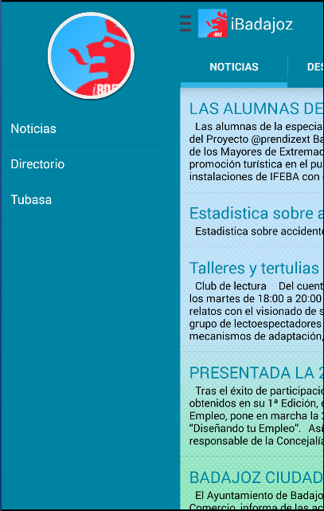

# iBadajoz-android 

This repo contains the sources of the android application [iBadajoz](https://play.google.com/store/apps/details?id=com.dcordero.ibadajoz&hl=es)

## Dependencies

The information about buses is fetched from AWS, take a look to [this repo](https://github.com/dcordero/Tubasa) for further information
